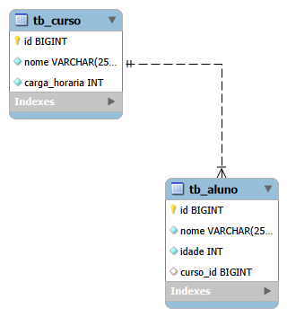
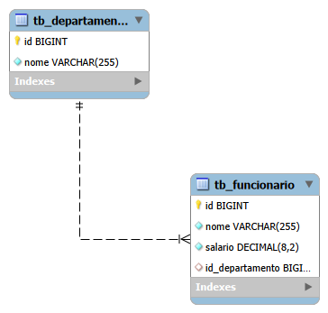
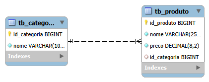

# Prática Avaliada 04 - Banco de Dados Relacional (SQL) 🚀

Este repositório contém a resolução de três atividades práticas avaliadas de modelagem, criação e manipulação de bancos de dados relacionais utilizando o **MySQL**.

---

## 🛠️ Tecnologias e Conceitos Praticados
* **SGBD:** MySQL
* **DDL (Data Definition Language):** Criação de bancos de dados, tabelas, definição de tipos de dados (`DECIMAL`, `BIGINT`), chaves primárias e chaves estrangeiras com restrição `ON DELETE SET NULL`.
* **DML (Data Manipulation Language):** Inserção, atualização e exclusão de registros de forma segura.
* **DQL (Data Query Language):** Consultas complexas usando `INNER JOIN`, `LEFT JOIN`, filtros (`WHERE`), ordenações (`ORDER BY`) e funções de string e formatação (`CONCAT`, `COALESCE`, `FORMAT`).

---

## 📂 Estrutura das Atividades

### EXERCÍCIO 1: Gestão de Cursos e Alunos (`exec_01.sql`)
Gerenciamento de matricula de alunos vinculados a cursos. 

* **Diagrama de Relacionamento (UML/DER):**
  ! 

* **Exemplo de Consulta Formatada (JOIN):**
  ```text
  Aluno: Ana | Idade: 20 | Curso: Java Completo | Carga Horária: 400
 
 ### EXERCÍCIO 2: Sistema de Funcionários e Departamentos (`exec_02.sql`)
Modelagem de colaboradores associados a departamentos com regras de integridade referencial.

* **Diagrama de Relacionamento (UML/DER):**
  

* **Exemplo de Consulta Formatada (JOIN):**
  ```text
  Funcionário: Carlos Oliveira | Salário: R$ 3.850,00 | Departamento: Tecnologia da Informação
 
### EXERCICIO 3: Sistema de Funcionários e Departamentos (exec_03.sql)
  Modelagem de colaboradores associados a departamentos com regras de integridade referencial.

**Diagrama de Relacionamento (UML/DER):**


 **Exemplo de Consulta Formatada (JOIN):**
  ```text
  Produto: Teclado Mecânico RGB | Preço: 115.00 | Categoria: Informática
```
 

### Contato 

Desenvolvido por [**Everly Rosendo**](https://github.com/Dev-Everly)
Para dúvidas, sugestões ou colaborações, entre em contato via GitHub ou abra uma issue!